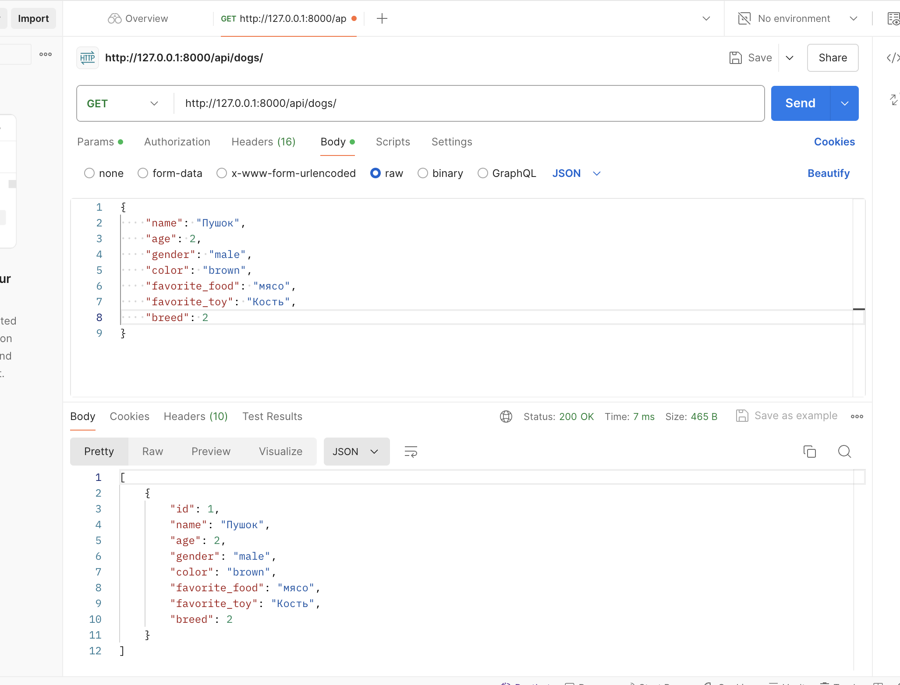
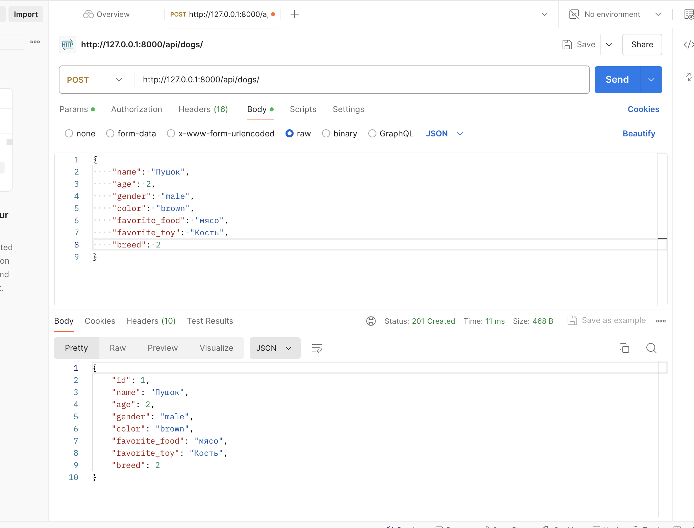
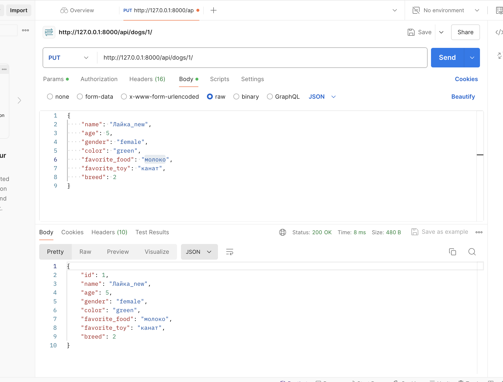
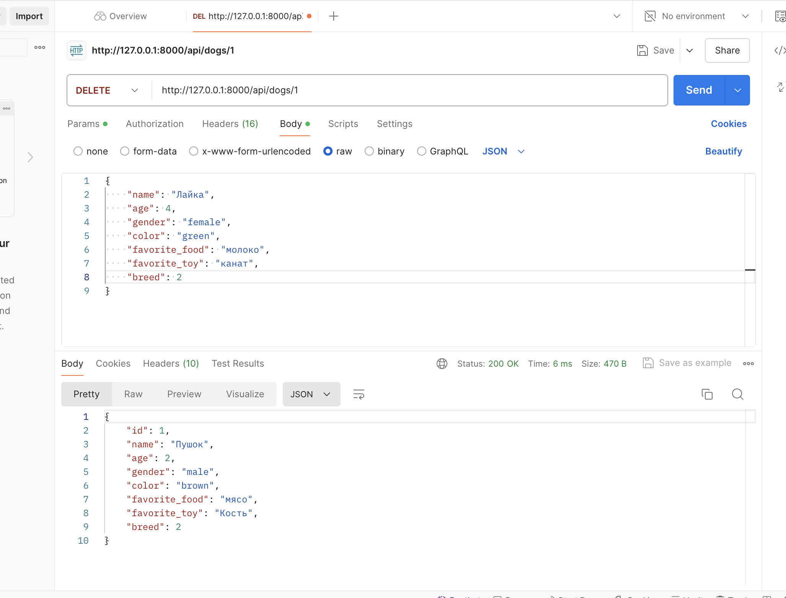
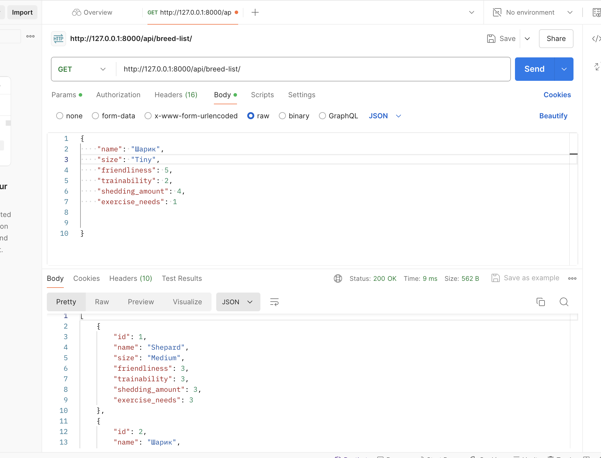
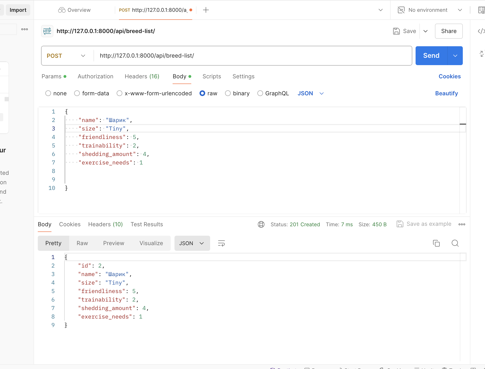
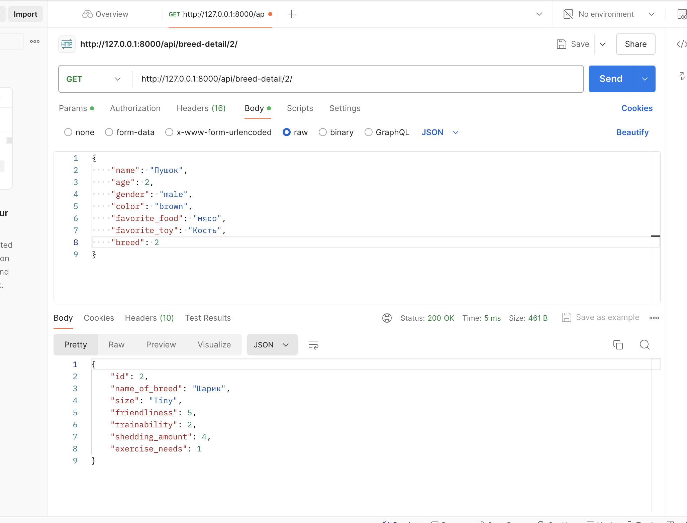
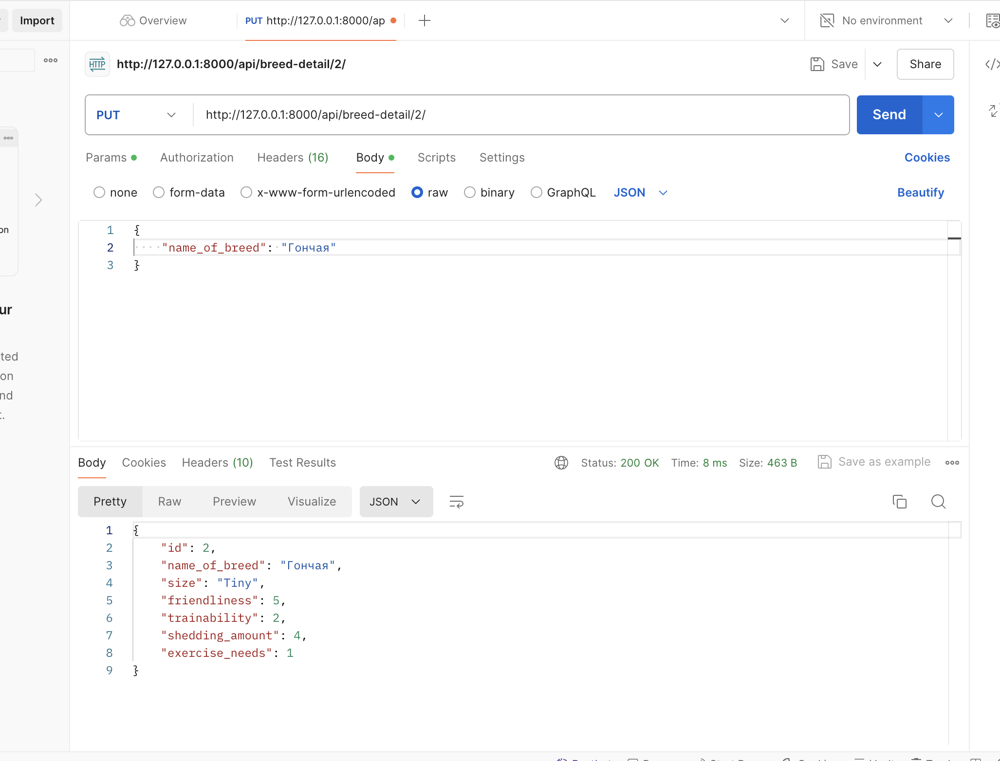
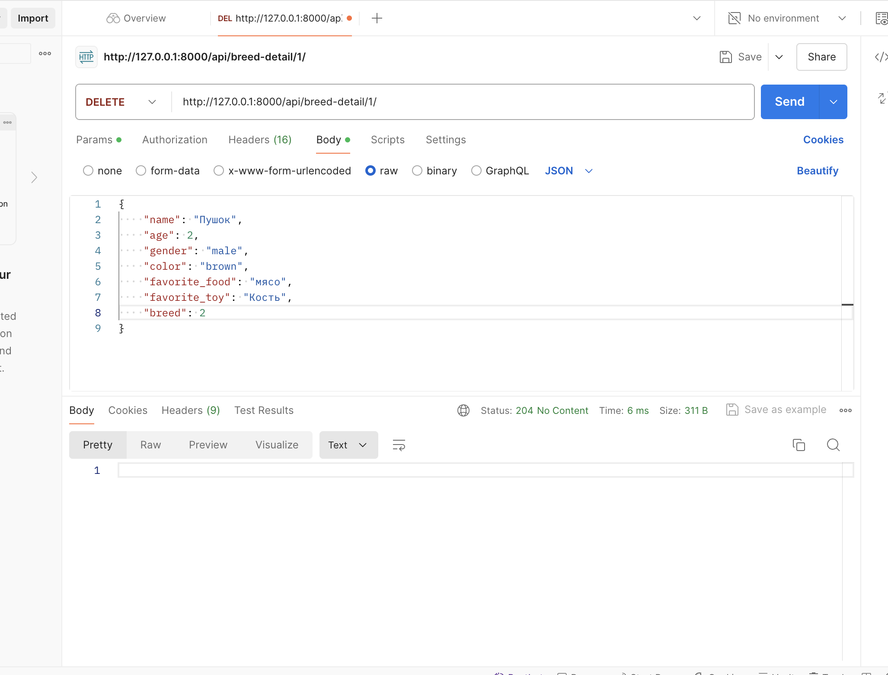

## You should build a new API endpoint

---

- That allows an end user to create a new Dog model by making a POST to /api/dogs
- View current dogs that have been saved to the server before by making a GET to /api/dogs, and get, modify, or delete an existing Dog record by making a GET, PUT, or DELETE request (respectively) to /api/dogs/<id> 
- Where <id> is the id of the Dog record to be retrieved, modified, or deleted. Since a Dog includes a foreign key to the breed
- You also need to make the same type of endpoints for dog breed at /api/breeds/ and /api/breeds/<id>.

#### test your endpoints with POSTMAN, taking screenshots of each type of request. There should be 5 requests total for each type of model, for a total of 10 tests and screenshots.

- ##### GET (list), POST to /api/dogs/
-   
-   
- ##### GET, PUT, DELETE to /api/dogs/<id>
-   
-   
-   
- ##### GET (list), POST to /api/breeds/
-   
-   
- ##### GET, PUT, DELETE to /api/breeds/<id>
-   
-   
-   

